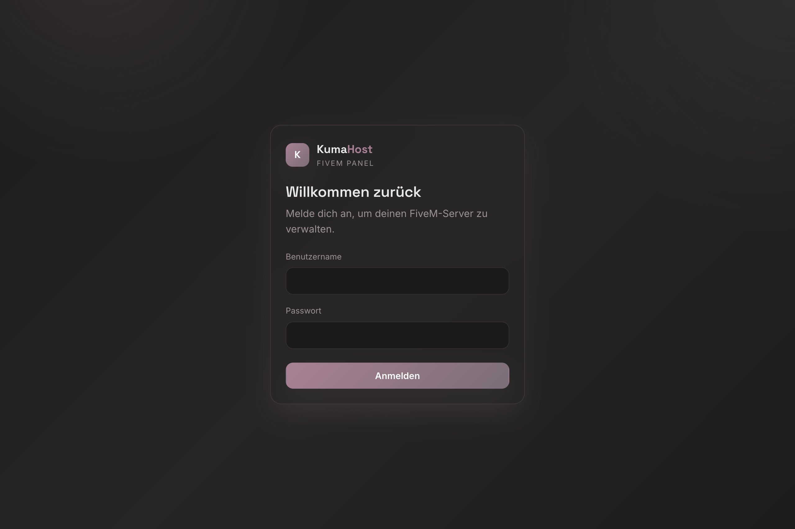
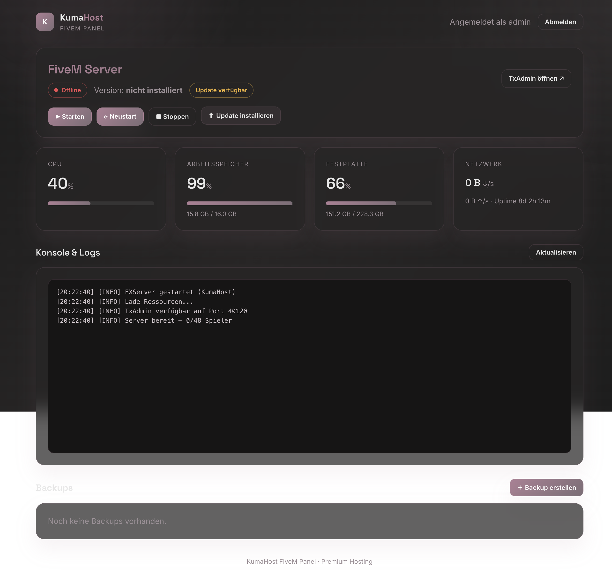

<div align="center">

# 🐾 KumaHost FiveM Installer

**Ein moderner, produktionsreifer FiveM-Installer mit Webpanel & REST-API — im Premium-Design von KumaHost.**

[](LICENSE)
[](install.sh)
[](api/)


</div>

---

## ✨ Überblick

KumaHost FiveM Installer bringt einen FiveM-Server (FXServer + TxAdmin) mit
einem einzigen Befehl auf deinen Linux-Server – inklusive automatischer
Systemprüfung, Dependency-Installation, Firewall-Konfiguration, validiertem
Artefakt-Download, `systemd`-Service und Health-Checks. Dazu gibt es ein
elegantes **Webpanel** und eine vollständige **REST-API** zur Verwaltung.

| Komponente | Beschreibung |
|------------|--------------|
| **Installer** | Bash-CLI mit interaktivem Menü & One-Line-Installation |
| **Webpanel** | KumaHost-gebrandetes Dark-Dashboard (Status, Metriken, Konsole, Backups) |
| **API** | REST-API mit JWT, Rate-Limiting, CSRF & Audit-Log |

## 📸 Screenshots

| Login | Dashboard |
|-------|-----------|
|  |  |

## 🚀 Schnellstart (One-Liner)

```bash
bash <(curl -sSL https://raw.githubusercontent.com/Fabio-Kumahost/kumahost-fivem-installer/main/install.sh)
```

Es öffnet sich das interaktive Menü:

```
[1] FiveM installieren
[2] FiveM + MariaDB installieren
[3] FiveM + MariaDB + phpMyAdmin installieren
[4] Server aktualisieren
[5] Backup erstellen
[6] Backup wiederherstellen
[7] Server entfernen
[8] Erweiterte Einstellungen
[9] Beenden
```

> Vollständige Anleitung: **[docs/INSTALL.md](docs/INSTALL.md)**

## 🧩 Funktionen

### Installer
- ✅ One-Line-Installation, selbst-bootstrappend über `curl`
- ✅ Debian 12/13 · Ubuntu 22.04/24.04 (x86_64)
- ✅ Automatische Systemprüfung (OS, Architektur, RAM, Disk, Netzwerk)
- ✅ Automatische Dependency-Installation (`apt`)
- ✅ Automatische Firewall-Prüfung (`ufw` / `firewalld`)
- ✅ Artefakt-Erkennung: **Recommended · Latest · Benutzerdefiniert**
- ✅ Download-Validierung (Größe + `xz`/`tar`-Integrität)
- ✅ Automatische FiveM- & TxAdmin-Einrichtung
- ✅ `systemd`-Service, Auto-Start, Health-Checks & Fehlerdiagnose
- ✅ Sichere Updates mit automatischem Backup & Rollback
- ✅ Backup erstellen / wiederherstellen (Dateien + MariaDB-Dump)

### Webpanel
- 🖥️ Server-Status (Online/Offline), CPU · RAM · Disk · Netzwerk (live)
- 🔗 TxAdmin-Link, installierte Version, Update-Hinweis
- ▶️ Start · Stopp · Neustart · Update
- 📜 Konsole & Logs
- 💾 Backup erstellen · herunterladen · wiederherstellen

### API
- 🔐 JWT-Authentifizierung, bcrypt-Hashing, Rate-Limiting, Input-Validierung
- 🛡️ CSRF-Schutz (Double-Submit), Secure-Cookies, Helmet-Header
- 🗄️ SQLite mit automatischer Migration & Audit-Log
- ⚙️ Privilegierte Aktionen via `execFile`-Allowlist + `sudoers`

> API-Referenz: **[docs/API.md](docs/API.md)**

## 🖥️ Webpanel installieren

```bash
git clone https://github.com/Fabio-Kumahost/kumahost-fivem-installer.git
cd kumahost-fivem-installer
sudo bash deploy/install-panel.sh
```

Installiert automatisch Node.js, nginx, richtet die Datenbank ein, erstellt
einen Admin-Benutzer, legt `sudoers`-Regeln & einen `systemd`-Service an und
holt optional ein Let's-Encrypt-Zertifikat.

## 🔄 Aktualisieren

```bash
bash <(curl -sSL https://raw.githubusercontent.com/Fabio-Kumahost/kumahost-fivem-installer/main/update.sh)
```

> Details: **[docs/UPDATE.md](docs/UPDATE.md)**

## 🗂️ Projektstruktur

```
kumahost-fivem-installer/
├── install.sh / update.sh / uninstall.sh   # Einstiegspunkte (One-Liner)
├── installer/
│   ├── lib/                # common, checks, deps, firewall, fivem, txadmin,
│   │                       # mariadb, phpmyadmin, service, backup, update,
│   │                       # uninstall, menu
│   └── templates/fivem.service
├── api/                    # Express REST-API (SQLite)
│   ├── src/{middleware,routes,services,scripts}
│   ├── schema.sql · tests/
├── webpanel/               # Vanilla-Frontend im KumaHost-Design
│   ├── index.html · dashboard.html · css/ · js/
├── deploy/                 # nginx-Site, systemd-Unit, install-panel.sh
└── docs/                   # INSTALL · UPDATE · API · TROUBLESHOOTING
```

## 🛠️ Entwicklung & Tests

```bash
cd api
npm install
npm test          # Integrationstests (node:test + supertest)
npm start         # API + Panel auf http://localhost:8787
```

## 🔒 Sicherheit

- Passwörter werden mit **bcrypt** gehasht, nie im Klartext gespeichert.
- Die API bindet standardmäßig an `127.0.0.1` und liegt hinter nginx.
- Der Panel-Service läuft als unprivilegierter Benutzer; privilegierte Befehle
  sind über eine **`sudoers`-Allowlist** strikt eingeschränkt.
- Konfigurierbare Secrets liegen ausschließlich in `api/.env` (nicht im Repo).

> Fehlerbehebung: **[docs/TROUBLESHOOTING.md](docs/TROUBLESHOOTING.md)**

## 🙌 Hinweise

Dies ist eine eigenständige, von Grund auf neu entwickelte Open-Source-Software.
Sie ist **nicht** mit Cfx.re / FiveM affiliiert. „FiveM" und „TxAdmin" gehören
ihren jeweiligen Eigentümern.

## 📄 Lizenz

[MIT](LICENSE) © 2026 KumaHost
